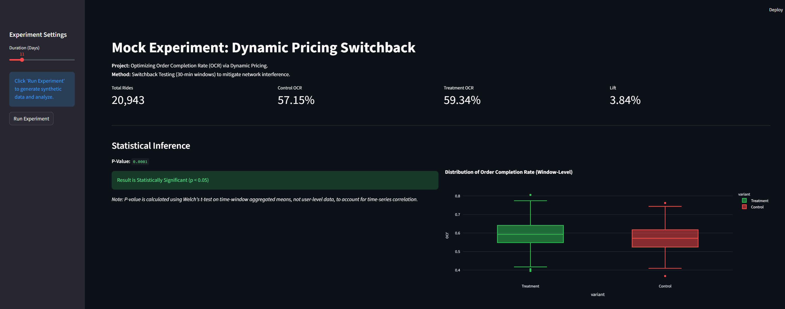
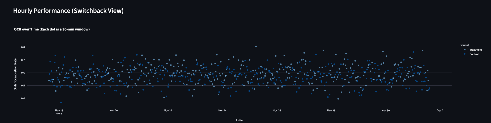

⚡ Dynamic Pricing Optimization: Switchback Experiment

Figure 1: Experiment Control and KPI Overview

Figure 2: Time-Series Analysis and Statistical Significance

📌 Project Overview

This project is a Mock Experimentation Platform designed to simulate a ride-hailing marketplace (like Bolt). It demonstrates how to solve Network Interference problems in two-sided marketplaces using Switchback Testing.

The Problem: Why not standard A/B Testing?

In a ride-hailing app, riders and drivers share a finite pool of liquidity.

If we assign User A to a "Low Price" group and User B to a "High Price" group, User A might book the last available driver.

User B now has no driver available, not because of the high price, but because User A "stole" the supply.

Result: The Control group is contaminated by the Treatment group (Spillover Effect / SUTVA Violation).

The Solution: Switchback Testing

Instead of randomizing users, we randomize time.

Method: The platform alternates between Control (Standard Pricing) and Treatment (Dynamic Surge) algorithms in 30-minute windows.

Analysis: Metrics are aggregated by time window, and a robust T-test is performed on the window means to determine statistical significance.

🛠️ Tech Stack

Language: Python 3.9+

Backend: FastAPI (Simulation Engine & Statistical API)

Frontend: Streamlit (Interactive Dashboard)

Analysis: SciPy (Welch’s T-test), Pandas, NumPy

🚀 How to Run Locally

1. Setup Environment

Open your terminal and create a virtual environment:

# Windows
python -m venv venv
.\venv\Scripts\activate

# Mac/Linux
python3 -m venv venv
source venv/bin/activate

2. Install Dependencies

pip install -r requirements.txt

3. Run the Backend (Simulation Engine)

Open a new terminal, activate venv, and run:

uvicorn backend.main:app --reload

The API will be available at https://www.google.com/search?q=http://127.0.0.1:8000

4. Run the Frontend (Dashboard)

Open a second terminal, activate venv, and run:

streamlit run frontend/app.py

📊 Key Metrics Defined

OCR (Order Completion Rate): Completed Rides / Total Requests. This is the primary metric for liquidity.

GMV (Gross Merchandise Value): Total revenue generated. Used as a guardrail metric.